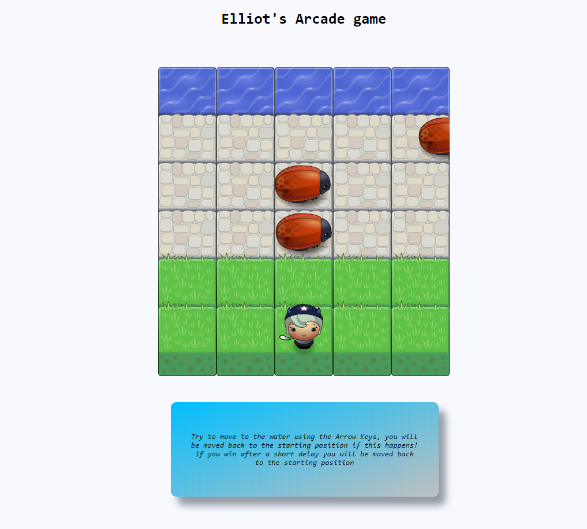

# Project Overview

In this project I was given some starting code that formed the foundation of the Classic Arcade Game Frogger. I used this starting code and implemented JavaScript to complete it. A number of important components were learnt in this project such as functions, objects, variables and more.

How the Game Works

The game is won by moving the character on-screen to the end of the screen where the water is situated. There are three bugs/ cockroaches moving across the screen. I could have added more but it looked clunky. They move at differing rates of movement, and are using delta time to give them the appearance of moving on-screen at a animated pace.

I have also added some instructions in the game for a basic overview of the controls. When the player hits the water after a short delay they will teleport back to the starting area.

## Why this Project?

This project helped me to develop my JavaScript skills for the first time in a tough environment. Use of the DOM was a huge component, as well as event listeners which would come in handy for projects to come. There is four important components for building the game.

1. The player can move left, right, up and down.

2. The enemies move at varying speeds on the paved block portion of the game board.

3. Once a the player collides with an enemy, the game is reset and the player moves back to the starting square

4. Once the player reaches the water (i.e., the top of the game board), the game is won.

# Running the Application

1. Download the repo off Github.

2. The application's opening /viewing point is at index.html. Download this file, it will then need to be opened within a browser.
